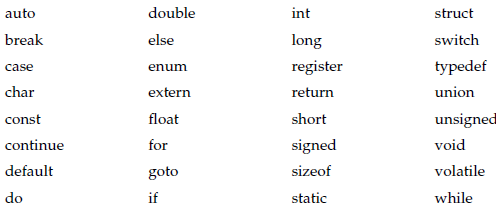
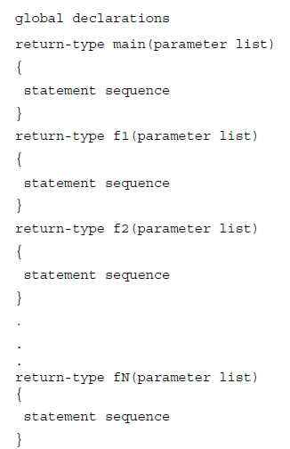

# An overview of C-Programming Language

* C++ is based on C programming Language. 

* **ANSI/ISO C Standard** is a base document for International C++ Standard.

* All C programs are also C++ programs but C++ does not use everything defined in CPP:
	* File I/O in CPP is object oriented and rarely uses C type I/O
	* Pre-processors are rarely given as much importance as in C language.

## C is a Middle Level Language

### Middle Level Language

C combines the best elements of high-level languages with the control and flexibility of assembly languages.

### Portability

C programs are portable and cross-platform.

### Support for Data Types

* Data Types define a set of values and a set of operations that can be performed.

* C has five in-built data types - int, char, float, long and double.

* C is not strongly typed - it permits type conversions.

### C does not provide Exception handling

Runtime error checking is not supported in C.

### C does not demand strict type compatibility between formal and actual arguments

Automatic conversion are supported.

### System Level Programming

C allows direct manipulation of bits, bytes, words and address pointers.

### Keywords

C only has 32 keywords (27 of original specification and 5 added by ANSI).

## C is a Structured Language

* C and C++ are not block structured.

* Allows **compartmentalization** - differentiation between **code** and **data**. 

* Local temportary variables are better for isolation and tight control. Global variables might lead to bugs spread entire code.

* Use of **Goto** is discouraged

* Allows placing statement anywhere on the line!

```C
printf      ("This is valid")   ;
```

* Main structural component for C is **functions** which are also the only sub-routine allowed in C

* **Code blocks** can also be used for compartmentalization

```C
x = 1; //1
{
x = 10; x++; //11
}
x++; //2
```

## C is a programmer's language

* C was created by the programmers and is made for the programmers.

* Allows efficiency, flexibility and direct system access like Assembly language

* Allows structured code and portability, which were drawbacks in Assembly Language.

## Keywords in C

* There are 32 Keywords in C

* All keywords are in complete lowercase. 

* 5 out of 32 keywords were not in original C keyword list - enum, cosnt, void, volatile and signed.



## Basic Form of C program



* Most compiler for C and C++ come with standard library.

* C++ standard library can be divided into two: **Standard Library Function** (C-library functions) and **Class Library** including OOPS based functions and **Standard Template Library (STL)**

* All the functions stored in C library are in **relocatable** format. Their absolute address is not stored, only offset. **Linking and loading process**

**Note:** C and C++ allows separate compilation. We can compile different codes and link them into one object code.

